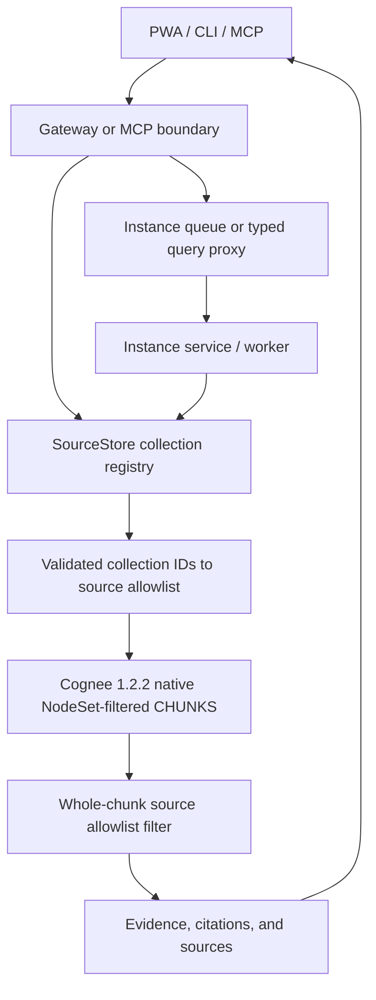
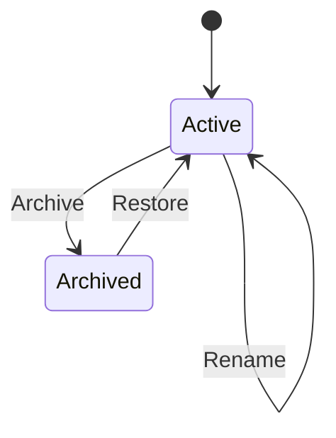

# Vault Collections - Plan

## Goal Capsule

- **Objective:** Node-Sets become optional, user-facing collections that organize sources within one vault and can scope retrieval, answers, and source browsing.
- **Authority:** This plan and the confirmed scope in the originating conversation govern product behavior; current repository privacy boundaries govern implementation choices. The implementation targets the latest stable Cognee release and fully adopts its supported retrieval and NodeSet capabilities.
- **Execution profile:** Upgrade and rebuild onto Cognee 1.2.2 first, prove native scoped retrieval, then implement test-first across persistence, reindexing, transport, PWA, CLI, and MCP surfaces.
- **Stop conditions:** Do not retain Cognee 0.3.9 as a production fallback. If upgrade, rebuild, native NodeSet filtering, source attribution, or privacy isolation fails, stop before exposing collection-scoped behavior and resolve the incompatibility. Never fall back from a requested collection scope to a broader query.
- **Tail ownership:** The implementing agent updates user documentation, validates migrations against a copy of existing data, runs the complete repository checks, and performs browser QA of every affected PWA flow.

---

## Product Contract

### Summary

Build vault-scoped collections as a `kb` control plane backed by native Cognee NodeSets: users can assign new or existing sources to several collections, browse sources by collection, and restrict chat or retrieval through Cognee's scoped retrieval. Vaults remain the privacy and processing boundary; collections only organize knowledge inside one vault.

### Problem Frame

The current PWA exposes a single free-text "Node-Set" field during capture. The value reaches `cognee.add`, but `kb` neither persists the assignment as source metadata nor uses it in source browsing or search. Suggestions are reconstructed from queue history, so the feature is write-only, accepts inconsistent spellings, and has no management lifecycle.

Cognee 1.2.2 passes `node_name` and AND/OR semantics into CHUNKS retrieval, and its LanceDB adapter enforces membership against `payload.belongs_to_set`. Collections therefore use immutable NodeSet keys as a first-class retrieval structure. `sources.db` remains the user-facing control plane for labels, lifecycle, desired membership, and synchronization state; Cognee is the indexed retrieval projection. Reassigning an existing source queues a source-scoped reindex, while the local source allowlist prevents stale index state from broadening results.

### Actors

- A1. **PWA user** captures, organizes, browses, and queries knowledge without needing Cognee terminology.
- A2. **CLI user** imports or queries knowledge with repeatable collection options.
- A3. **MCP agent** discovers collections and applies them to ingest or retrieval through explicit tool parameters.
- A4. **Operator** upgrades existing instance databases and controls which vaults show collection UI on the current device.

### Requirements

**Collection model and lifecycle**

- R1. Each collection belongs to exactly one vault and has a stable internal ID, a mutable display label, and an active or archived lifecycle state.
- R2. Labels are unique within a vault after whitespace and case normalization, while the same label may exist in different vaults.
- R3. A source may belong to zero or more collections in its own vault, and `kb` persists these assignments independently from queue history.
- R4. Users can create, rename, archive, and restore collections without changing Cognee graph data.

**Capture and discovery**

- R5. Capture presents a multi-select labeled "Sammlungen" when the feature is enabled for the selected vault and leaves the existing per-source Cognee provenance behavior unchanged.
- R6. Sources show their collections, allow reassignment through a queued source-scoped reindex, expose synchronization state, and can be filtered by source type and one or more collections within the selected vault.
- R7. Existing free-form NodeSet values are not imported as collections because their source membership cannot be proven; existing sources begin unassigned and can be organized explicitly in the sources UI.

**Scoped retrieval**

- R8. Chat, retrieval APIs, CLI, and MCP can restrict a question to one or more active collections; multiple selections use OR semantics in the first version.
- R9. An empty collection filter means no collection restriction but remains limited to the requested vault; invalid, archived, or cross-vault IDs fail clearly instead of silently broadening a query.
- R10. Before synthesis, `kb` removes every complete evidence chunk whose verified source IDs are not in the selected vault and collection union; unresolved chunks are excluded rather than partially redacted or silently accepted.
- R10a. Collection-scoped retrieval passes immutable collection NodeSet keys and explicit OR semantics to Cognee 1.2.2 before applying the local source allowlist as defense in depth.
- R10b. A source whose desired collection membership is not yet indexed cannot leak into a removed collection; newly added membership becomes searchable only after its reindex job completes.

**Configuration and parity**

- R11. PWA settings store an enabled/disabled preference per vault on the current device; disabling hides collection controls but neither removes assignments nor disables backend, CLI, or MCP support.
- R12. Existing and newly discovered vaults default to collections enabled, preserving the current visible capability while allowing users to simplify individual vaults.
- R13. CLI and MCP expose collection discovery plus ingest and query selection, but collection lifecycle mutations remain limited to the authenticated Gateway API and PWA.
- R14. A vault supports at most 100 active collections, a source or query accepts at most 10 collection IDs, and normalized labels contain 1-64 characters without control characters.

### Key Flows

- F1. **Capture into collections**
  - **Trigger:** A1 selects a vault and enters a source.
  - **Actors:** A1
  - **Steps:** The PWA loads active collections for that vault, accepts zero or more selections, submits stable collection IDs, and shows the existing queue progress.
  - **Outcome:** The source is stored with desired and indexed assignments, while Cognee receives immutable collection NodeSet keys alongside its existing source-provenance key.
- F2. **Ask within collections**
  - **Trigger:** A1, A2, or A3 selects one or more collections and asks a question.
  - **Actors:** A1, A2, A3
  - **Steps:** `kb` validates collection ownership and state, resolves immutable NodeSet keys and the indexed source union, asks Cognee for native OR-scoped CHUNKS, filters complete chunks again by that allowlist, and synthesizes only from retained evidence.
  - **Outcome:** The answer, citations, gaps, and sources are constrained to at least one selected collection.
- F3. **Organize sources**
  - **Trigger:** A1 opens the sources page for a vault.
  - **Actors:** A1
  - **Steps:** The PWA loads source metadata and active collections, then combines type and collection filters.
  - **Outcome:** The source list and empty states accurately reflect the active filters.
- F4. **Manage a collection**
  - **Trigger:** A1 renames, archives, or restores a collection.
  - **Actors:** A1
  - **Steps:** `kb` changes local lifecycle metadata and leaves source assignments and Cognee state intact.
  - **Outcome:** The visible collection lifecycle changes without destructive data or graph edits.
- F5. **Hide collection UI for a vault**
  - **Trigger:** A1 disables collections for one vault in Settings.
  - **Actors:** A1
  - **Steps:** The PWA stores the preference locally and suppresses capture, sources, chat, and management controls for that vault.
  - **Outcome:** Existing assignments and API capabilities remain intact and reappear when the preference is enabled again.
- F6. **Reassign an existing source**
  - **Trigger:** A1 chooses "Sammlungen bearbeiten" on a source row.
  - **Actors:** A1
  - **Steps:** The shared selector loads active collections, preserves archived assignments as read-only labels, atomically records desired assignments, and queues one idempotent source-scoped reindex job.
  - **Outcome:** Source browsing reflects the desired assignment immediately, the UI shows synchronization progress, removed membership is excluded immediately by the local safety filter, and newly added membership becomes searchable after reindex completion.

### Acceptance Examples

- AE1. Given two active collections in `allgemein`, when a source is captured with both selected, then desired and indexed metadata list both and Cognee indexes both immutable collection NodeSet keys alongside provenance.
- AE2. Given no selected collection, when a source is captured, then it remains unassigned and vault-wide query behavior is unchanged.
- AE3. Given collections `Projekt A` and `Compliance`, when both are selected for chat, then evidence from either collection may appear and the text of every chunk outside both is removed before synthesis.
- AE4. Given a collection ID from another vault, when it is submitted for ingest or query, then the request fails and no job or broad query is created.
- AE5. Given `Projekt A` is renamed to `Apollo`, when an existing source or filter is displayed, then the UI shows `Apollo` without reindexing because its immutable Cognee NodeSet key is unchanged.
- AE6. Given an existing unassigned source, when the user adds `Apollo`, then the source immediately shows the desired assignment and a synchronization state; after its queued reindex succeeds, collection-scoped chat retrieves it through Apollo's native NodeSet filter.
- AE9. Given a source is removed from `Apollo`, when its reindex is pending or fails, then Apollo-scoped retrieval excludes it immediately through the indexed-membership allowlist and never broadens the query.
- AE7. Given collections are disabled for `privat` in Settings, when the user visits capture, sources, or chat for `privat`, then collection controls are hidden while another enabled vault still shows them.
- AE8. Given a label containing control characters, more than 64 normalized characters, or a duplicate normalized name, when any public surface submits it, then validation fails without creating or changing a collection.

### Success Criteria

- A user can see a collection's effect in capture, sources, and chat without encountering the term "Node-Set".
- Every scoped answer remains evidence-first and contains no chunk text or source outside the selected vault and collection union.
- Rename, archive, and restore do not require Cognee graph mutation because NodeSet keys are immutable; source reassignment is completed by an idempotent source-scoped reindex job.
- Existing vault-wide capture and query flows behave identically when no collection filter is selected.
- The full Python and web test suites, static checks, PWA build, and browser QA pass after migration from an existing database.

### Scope Boundaries

**In scope**

- Vault-scoped collection persistence, create/rename/archive/restore lifecycle, capture assignment, queued source reindexing, source filtering, native query scoping, PWA settings, CLI parity, MCP parity, Cognee 1.2.2 migration, and documentation.
- OR semantics for selecting several collections.
- Device-local PWA visibility preferences.

**Outside this feature**

- Collections as authorization, privacy, sharing, or processing-wall boundaries.
- Cross-vault collections or queries that combine collections from different vaults.
- Automatic collection suggestions, LLM classification, nested collections, colors, icons, or ordering.
- Making collection NodeSets the user-facing lifecycle store, graph-key aliases based on mutable labels, and automatic migration of historic free-form NodeSet labels.
- Destructive deletion of NodeSet graph data.

#### Deferred to Follow-Up Work

- AND semantics and saved collection-filter presets.
- Collection merge.
- Optimizing reassignment through in-place NodeSet-edge mutation if a later Cognee API makes that safer than source-scoped reindexing.

---

## Planning Contract

### Key Technical Decisions

- KTD1. **`sources.db` becomes the collection source of truth.** Collection invariants live behind `SourceStore`. Gateway, CLI, and MCP use short-lived cognee-free store connections for discovery and validation; the worker and instance service revalidate authoritatively where needed.
- KTD2. **Collections have a local control plane and a Cognee retrieval projection.** `sources.db` owns stable IDs, labels, lifecycle, desired membership, indexed membership, and sync state. Cognee receives immutable collection IDs as NodeSet keys during ingestion and reindexing. Mutable labels never become graph identifiers.
- KTD4. **Archive replaces destructive delete.** Archived collections disappear from new selections but retain history and can be restored. This avoids orphaned graph membership and accidental data loss.
- KTD5. **Collection assignment is indexed alongside provenance.** The worker passes the existing per-source provenance NodeSet plus immutable collection NodeSet keys to Cognee 1.2.2 and commits indexed membership only after successful `add`/`cognify` completion.
- KTD6. **Cognee 1.2.2 native filtering is the primary retrieval path.** `kb` sends selected collection NodeSet keys with OR semantics to CHUNKS and applies the indexed source allowlist afterward as defense in depth. Candidate retrieval remains bounded and never retries unfiltered.
- KTD7. **Multiple selected collections mean native NodeSet OR plus verified source union.** Both layers implement the same semantics, so Cognee improves precision and recall while `SourceStore` protects against stale, unresolved, or foreign chunks.
- KTD10. **Reassignment uses one source-level revision and a transactional outbox.** In one `sources.db` transaction, an assignment change increments `collection_revision`, records desired membership, marks the source pending, and inserts an outbox event keyed by source and revision. A dispatcher idempotently creates the corresponding job in the separate `queue.db` and marks the event delivered; startup recovery retries undelivered events. Success advances `indexed_collection_revision`; failure preserves the last indexed membership, records a source-level actionable error, and permits retry. Assignment rows themselves carry no independent sync state.
- KTD11. **Removal is safe before addition is live.** Query allowlists are derived from indexed membership intersected with current desired membership. This excludes removed collections immediately, while additions become searchable only after successful reindexing.
- KTD16. **Track the latest stable Cognee deliberately.** U10 checks PyPI again at execution time, pins the then-latest stable release exactly in the lockfile, records it in README, and reruns the complete compatibility and migration gates. Cognee 1.2.2 is the researched baseline as of 2026-07-11; a newer stable release replaces it only after the same NodeSet, provider, ACL, reindex, rebuild, and rollback proofs pass.
- KTD8. **The PWA feature toggle is a device preference.** Store a versioned per-vault map in local storage, default missing entries to enabled, and centralize the read/write helper so every page applies identical behavior.
- KTD9. **Public contracts use stable collection IDs or labels.** The PWA uses IDs. CLI and MCP resolve user-facing labels within a vault and report ambiguity or missing definitions.
- KTD12. **Validation errors survive transport.** Omitted or empty `collection_ids` means no collection filter while retrieval remains restricted to the requested vault's verified source allowlist. Any non-empty list is validated all-or-nothing; upstream 4xx details remain client errors while transport and malformed-response failures remain 502.
- KTD13. **Chat scope persists only within the current vault session.** Selections remain active across questions in one vault, are displayed with every message, and clear on vault change. Historical messages retain their captured labels after rename or archive.
- KTD14. **Mutation surfaces stay human-controlled.** The authenticated PWA and Gateway API create and manage collections. CLI and MCP only discover, assign during ingest, and select during per-vault queries.
- KTD15. **Shared limits and label normalization apply everywhere.** Normalize Unicode, collapse whitespace, trim, reject control characters, enforce the R14 counts and length, escape terminal/log output, and return MCP labels only in structured fields.

### High-Level Technical Design

#### Data and request flow

Collection IDs are validated at the outer boundary and resolved again within the instance process before use. Vault ownership is checked at both seams because multiple vaults share an instance database and service. When U10 enables scoped retrieval, the filter removes entire chunk text, not only foreign source IDs from an otherwise retained evidence object.

#### Collection lifecycle

Archive is reversible and does not delete source assignments. Archived labels remain visible on existing sources but cannot be newly selected until restored.

### System-Wide Impact

- **Data lifecycle:** `sources.db` gains durable collection records, desired and indexed source assignments, and synchronization state. Schema changes, reassignment, lifecycle mutations, and reindex completion must be transactional and safe under concurrent connections.
- **Privacy:** Every collection lookup, association, lifecycle mutation, and query filter must validate the vault even when records share the same instance database. Whole foreign chunks must be discarded because removing only their source IDs still leaks their text into synthesis.
- **Retrieval quality:** Collection scoping reduces the evidence candidate set. Empty or unavailable evidence must continue through the existing gap-analysis path rather than triggering an unscoped fallback.
- **Agent parity:** MCP and CLI discovery, ingest, and per-vault query filters operate on the same durable collection objects as the PWA. They cannot mutate collection lifecycle. `search_all` and `retrieve_all` remain collection-free because collection IDs are vault-specific.
- **Operations:** Cognee 1.2.2 is a required platform migration. U10 rehearses backup, raw-layer rebuild, health checks, cutover, and rollback entirely on disposable copies. U8 performs the production rebuild and atomic cutover only after all feature and regression gates pass. Old 0.3.9 stores remain untouched as rollback artifacts. The collection schema migration is additive and idempotent.

### Risks and Mitigations

- **Cognee platform migration:** The upgrade from 0.3.9 to 1.2.2 crosses the 1.0 boundary, replaces the Kuzu-era graph stack with Ladybug/unified storage internals, and changes dependencies such as `fastapi-users`. Treat it as a rebuild-and-cutover migration, remove obsolete 0.3.9 workarounds, and verify every provider, ACL, result-shape, and event-loop assumption before switching either wall.
- **False broadening:** A rejected or empty collection selection could accidentally become a broader query. Validate before proxying and distinguish "no collection filter, still vault-scoped" from "requested filter resolved to no allowed sources."
- **Historic NodeSet ambiguity:** Existing free-form values cannot be mapped reliably to sources. Version 1 leaves them untouched and documents that users must explicitly organize existing sources.
- **Local UI drift:** A device-local toggle can differ across browsers. Label it as a display preference and avoid presenting it as a server-wide vault setting.
- **Reindex failure:** A failed reassignment could leave desired and indexed membership divergent. Persist both states, exclude removals immediately, expose pending/failed status, deduplicate jobs, and provide retry without claiming additions are searchable early.
- **Untrusted labels:** Labels cross browser, API, terminal, logs, and MCP. KTD15 centralizes validation and output safety instead of relying on browser escaping alone.

### Sequencing

Run U10 before any schema or public-contract work. It upgrades the integration to 1.2.2 in isolation, rehearses a raw-layer rebuild and wall cutover on copies, and validates native NodeSet retrieval plus safe source replacement. Resolve failures rather than retaining a dual-version architecture. Then implement persistence, lifecycle APIs, ingest and reassignment projection, retrieval, UI flows, and CLI/MCP parity. U8 performs the production cutover only after every preceding gate passes.

### Sources and Research

- `kb/sources.py` is the existing instance-local metadata store and migration pattern.
- `kb/worker.py` currently accepts explicit NodeSets; version 1 formalizes immutable collection NodeSet keys alongside the existing per-source provenance NodeSet.
- `kb/queue.py` currently derives suggestions from historical job payloads; version 1 stops using that endpoint as collection storage.
- `kb/query_service.py` and `kb/cognee_io.py` provide the evidence-first retrieval boundary where collection filtering must occur.
- [Cognee NodeSets](https://docs.cognee.ai/core-concepts/further-concepts/node-sets) documents graph materialization and NodeSet-scoped search.
- [Cognee search basics](https://docs.cognee.ai/guides/search-basics) documents `node_type`, `node_name`, and NodeSet filtering used by the target implementation.
- [Cognee 1.2.2 on PyPI](https://pypi.org/project/cognee/) is the latest stable package as of 2026-07-11. Its tagged `ChunksRetriever` and retriever factory pass `node_name` plus `node_name_filter_operator` through CHUNKS search, and its LanceDB adapter applies `array_has_any` or `array_has_all` to `payload.belongs_to_set`.
- [Cognee releases](https://github.com/topoteretes/cognee/releases) record the graph-backend replacement from Kuzu to Ladybug in the 1.x line. Together with the current repository's 0.3.9-specific dependency workarounds, this requires an isolated upgrade and data migration/rebuild proof rather than an in-place version edit.

---

## Implementation Units

### U10. Upgrade the Cognee platform and prove native scoped retrieval

- **Goal:** Establish Cognee 1.2.2 as the only supported runtime, rehearse a safe rebuild-and-cutover migration, and validate native collection-scoped retrieval before public collection contracts are introduced.
- **Requirements:** R8, R9, R10, R10a, R10b
- **Dependencies:** None
- **Files:** `kb/cognee_io.py`, `kb/query_service.py`, `tests/test_cognee_io.py`, `tests/test_query_service.py`, `tests/fixtures/collections/`
- **Approach:** Resolve and exactly pin the latest stable Cognee release at execution time (researched baseline: 1.2.2), then remove or replace 0.3.9-specific workarounds. Inventory import, configuration, provider, dependency, event-loop, ACL, graph-store, and result-shape changes. Build new disposable stores from the raw layer; never open a 0.3.9 production store in place. Use a fixture with two walls, at least two vaults, four collections, multi-chunk documents, a sparse collection, and two sources that produce shared graph entities. Prove immutable collection NodeSets, native OR-filtered CHUNKS, stable chunk-to-source attribution, whole-chunk verification, bounded retrieval, source-scoped delete/re-add/cognify reindexing, preservation of unrelated graph data, idempotency, and a rehearsed data-directory cutover with rollback. If Cognee cannot remove one source without damaging shared graph state, replace source-scoped deletion with a safe supported mechanism or a queued vault rebuild before proceeding.
- **Execution note:** Run this unit first and resolve every failed compatibility or migration gate before later units. The completed implementation does not support running on Cognee 0.3.9.
- **Test scenarios:**
  1. Every retrieved chunk in the fixture resolves to exactly one known source and vault.
  2. A collection-scoped query sends zero excluded, foreign-vault, or unresolved chunk text to synthesis.
  3. At least 80% of prepared questions return a relevant allowed chunk in the top five after filtering.
  4. Candidate retrieval never exceeds 100 chunks and never retries with a broader scope.
  5. The sparse collection at no more than 10% corpus prevalence meets the same security and recall gates.
  6. Cognee 1.2.2 imports with the supported dependency set and preserves current local/cloud provider guards, one-loop operation, ACL behavior, and normalized evidence/source shapes.
  7. Native OR filtering returns only chunks whose `belongs_to_set` payload contains a selected immutable collection key, with the local allowlist still rejecting stale or foreign membership.
  8. A source-scoped reindex removes the prior indexed representation, recreates it once with the current immutable collection keys, and produces no duplicate chunks after retry.
  9. Reindexing one of two sources with shared entities leaves the other source's chunks, references, graph relationships, and query answers intact; failure blocks source-scoped deletion as the implementation strategy.
  10. Desired-minus-indexed additions remain unavailable until completion, while removals are excluded immediately and no state triggers an unscoped retry.
  11. A fresh rebuild from the raw layer, atomic cutover rehearsal, health check, and rollback to untouched copied stores succeeds for both walls; in-place opening of production stores is prohibited.
- **Verification:** Cognee 1.2.2 import, provider guards, native filtering, attribution, zero-leakage, recall, reindex idempotency, rebuild, rehearsed cutover, and rollback all pass. Any failure blocks the feature and is fixed at the new-version integration rather than creating a permanent 0.3.9 fallback.

### U1. Persist collection definitions and source assignments

- **Goal:** Establish a vault-safe collection domain in the existing source database.
- **Requirements:** R1, R2, R3, R4, R7
- **Dependencies:** U10
- **Files:** `kb/sources.py`, `tests/test_sources.py`
- **Approach:** Add collection tables plus desired and indexed source-assignment tables with stable IDs, active/archived state, Unicode normalization, immutable Cognee NodeSet keys derived from IDs, unique source-collection pairs, foreign keys, and vault-aware constraints. Store `collection_revision`, `indexed_collection_revision`, `collection_sync_status`, `collection_sync_error`, and `collection_sync_updated_at` once per source. Add a unique source-revision reindex outbox in `sources.db`. Enable SQLite foreign keys on every connection and provide atomic desired-assignment-plus-outbox creation and revision-guarded reindex completion.
- **Execution note:** Start with migration and invariant tests against both fresh and legacy `sources` schemas.
- **Patterns to follow:** Existing additive SQLite migration in `SourceStore.__init__`, explicit column lists, WAL mode, and vault-scoped lookups.
- **Test scenarios:**
  1. Creating `Projekt A` twice with whitespace or case variations in one vault returns a uniqueness error, while creating it in another vault succeeds.
  2. Assigning two collections to one source round-trips in stable display order; direct SQL and application calls both reject a collection or source from another vault.
  3. Renaming changes the label but leaves the collection ID and assignments unchanged.
  4. Archive hides a collection from active lists, restore returns it, and neither operation removes source assignments.
  5. Replacing desired assignments is atomic, permits an empty set, increments the source revision, marks the source pending, preserves indexed membership until reindex completion, and rejects archived or cross-vault collections.
  6. A stale completion cannot advance `indexed_collection_revision`, overwrite a newer desired assignment set, or clear a newer failure; assignment rows contain no contradictory per-membership status.
  7. Concurrent normalized-label creation yields one collection and a deterministic conflict.
  8. Opening an old database creates the new tables and source-level sync columns without changing existing source content.
  9. Existing sources initialize at revision zero with matching indexed revision, `synced` state, and no collection membership or outbox event.
- **Verification:** Fresh and migrated databases enforce all lifecycle and vault invariants without consulting the job queue.

### U2. Add vault-scoped collection management contracts

- **Goal:** Replace the queue-derived NodeSet endpoint with authenticated collection discovery and lifecycle APIs.
- **Requirements:** R1, R2, R4, R6, R9, R14
- **Dependencies:** U1
- **Files:** `kb/gateway.py`, `tests/test_gateway.py`
- **Approach:** Add list/create/rename/archive/restore routes plus read-only source-assignment and synchronization views scoped by vault. Return stable IDs, normalized labels, lifecycle state, source counts, and source-level sync status. Replace the PWA's use of the legacy NodeSet endpoint; keep that endpoint unchanged only for compatibility during this feature. The mutating reassignment route belongs to U3 so its database change, queue job, and retry contract ship atomically.
- **Patterns to follow:** `_resolve_vault`, per-request `SourceStore`, authenticated `/api` router, and explicit cross-vault checks used by source and job endpoints.
- **Test scenarios:**
  1. Authenticated users can list and create collections only for known vaults; unauthenticated and unknown-vault requests retain existing error behavior.
  2. Rename, archive, and restore return the resulting collection view and enforce shared label limits.
  3. A collection ID from a sibling vault sharing the same instance database is rejected for every mutation.
  4. Source views return desired assignments, indexed assignments, revision, and synchronization state without exposing raw Cognee identifiers.
  5. Labels containing control characters, invalid normalized length, or duplicate normalized identity fail consistently.
- **Verification:** Collection management is usable through authenticated vault-scoped APIs and queue history is no longer the live catalog.

### U3. Index collection membership during ingest and reassignment

- **Goal:** Project desired collection membership into Cognee 1.2.2 NodeSets during initial ingest and source-scoped reindexing.
- **Requirements:** R3, R5, R6, R9, R10b
- **Dependencies:** U1, U2
- **Files:** `kb/gateway.py`, `kb/queue.py`, `kb/worker.py`, `kb/cognee_io.py`, `kb/sources.py`, `tests/test_gateway.py`, `tests/test_queue.py`, `tests/test_worker.py`, `tests/test_cognee_io.py`
- **Approach:** Accept up to ten collection IDs, validate before enqueueing, persist desired membership, and pass immutable collection NodeSet keys to Cognee during initial `add`/`cognify`. Add the authenticated reassignment route here: one `sources.db` transaction validates vault ownership and active collections, replaces desired membership, increments the source revision, marks it pending, and writes a unique outbox event. The dispatcher idempotently creates a reindex job keyed by source and revision in `queue.db`; request completion attempts immediate dispatch, while instance startup and the worker loop recover undelivered events. The worker safely removes that source's prior Cognee representation using the U10-proven strategy, re-adds its raw content with current provenance and collection NodeSets, cognifies it, then promotes desired membership to indexed membership only if the revision is still current.
- **Execution note:** Implement the request and worker contracts test-first, preserving the current failure cleanup and dedup behavior.
- **Patterns to follow:** Current pre-enqueue vault validation, worker cleanup on Cognee failure, raw frontmatter provenance, and per-vault content deduplication.
- **Test scenarios:**
  1. Covers AE1. Two selected collections produce one stored source, two desired/indexed associations, and two immutable collection NodeSet keys alongside provenance in the Cognee call.
  2. Covers AE2. No selected collection creates an unassigned source and indexes only existing provenance.
  3. Covers AE4. Unknown, archived, more than ten, duplicate, or cross-vault collection IDs are rejected before a job is created.
  4. A failed initial Cognee ingest removes the source and its assignments through existing cleanup; a failed reindex preserves the last indexed membership, marks the new desired state failed, and supports retry.
  5. A deduplicated source does not create assignments for work that was skipped.
  6. Reassignment accepts zero to ten active collection IDs and rejects archived, unknown, duplicate, or cross-vault IDs without changing assignments or creating a job.
  7. Two rapid reassignment requests leave one authoritative latest revision; an older running job cannot publish stale indexed membership, and the latest revision remains queued or retryable.
  8. A crash after the `sources.db` commit but before `queue.db` insertion leaves one undelivered outbox event; recovery creates exactly one job and repeated dispatch is harmless.
- **Verification:** Every completed ingest or reindex has matching desired/indexed membership and matching immutable Cognee NodeSets; retries are idempotent and stale jobs cannot overwrite a newer assignment revision.

### U4. Scope evidence retrieval and answers by collection

- **Goal:** Use Cognee 1.2.2 native NodeSet filtering for collection-scoped CHUNKS while retaining whole-chunk source verification before synthesis.
- **Requirements:** R8, R9, R10, R10a, R10b
- **Dependencies:** U10, U1, U2, U3
- **Files:** `kb/query_models.py`, `kb/cognee_io.py`, `kb/query_service.py`, `kb/instance_service.py`, `kb/query_proxy.py`, `kb/gateway.py`, `tests/test_cognee_io.py`, `tests/test_query_service.py`, `tests/test_instance_service.py`, `tests/test_query_proxy.py`, `tests/test_gateway.py`
- **Approach:** Carry optional collection IDs through query and search contracts. Resolve them all-or-nothing to immutable NodeSet keys and an indexed-and-still-desired vault-scoped source union. Pass the keys to Cognee CHUNKS with explicit OR semantics and bounded `top_k`, discard every returned chunk lacking a verified allowlisted source ID, rerank retained chunks, and synthesize only from them. Omitted or empty means vault-wide but still uses the vault source allowlist. Preserve instance 4xx validation through a typed proxy error; transport and malformed-response failures remain 502.
- **Execution note:** Begin with failing transport and Cognee-call contract tests because a dropped field at any seam would silently broaden answers.
- **Patterns to follow:** Evidence-first `query_service.answer`, transport normalization in `query_proxy`, instance-local source trust boundary, and gap analysis for empty evidence.
- **Test scenarios:**
  1. Covers AE3. Selecting two active collections builds their verified source union, drops complete chunks outside it, reranks the survivors, and gives synthesis only retained evidence.
  2. No collection field uses all known source IDs in the one requested vault and drops complete foreign-vault or unresolved chunks.
  3. Covers AE4. Cross-vault, archived, or unknown collection IDs never reach Cognee and cannot degrade into a broader query.
  4. Covers AE6 and AE9. Removal changes the safety allowlist immediately; addition enters the allowlist and native NodeSet results only after successful source reindexing.
  5. A valid collection with no evidence returns the normal no-evidence gap response without performing a second unscoped search.
  6. Query and retrieval endpoints, proxy calls, and instance request models preserve omitted, empty, and non-empty collection semantics plus the request ID.
  7. Instance validation 4xx details survive the proxy and Gateway, while transport and non-JSON failures remain 502.
  8. Pending or failed synchronization is reported without falling back to a broad query; the API can return a scoped no-evidence response while an addition is not yet indexed.
- **Verification:** Contract and integration tests prove native NodeSet parameters reach Cognee and invalid, empty, unresolved, stale, cross-vault, and collection-excluded chunks cannot broaden synthesis input.

### U5. Replace the capture field and enrich the sources page

- **Goal:** Make collections understandable and immediately useful during capture and source discovery.
- **Requirements:** R5, R6, R11, R12
- **Dependencies:** U2, U3
- **Files:** `web/src/pages/index.astro`, `web/src/pages/sources.astro`, `web/src/lib/api.js`, `web/src/lib/bootstrap.js`, `web/tests/api.test.mjs`, `web/tests/ui-source.test.mjs`, `web/tests/ui-collections.test.mjs`
- **Approach:** Replace the Node-Set text input with one shared accessible multi-select used by Capture, Sources, and Chat. Define loading, none available, populated, create pending, created-and-selected, normalized duplicate, failure, stale selection, and disabled states. Show chips on source rows, combine type and collection filters, and add "Sammlungen bearbeiten" for atomic reassignment.
- **Patterns to follow:** Existing vault bootstrap, token-aware API helper, chip filters, text-safe DOM construction, and mobile-first layout in `Base.astro`.
- **Test scenarios:**
  1. Covers AE1. Selecting two collections submits their IDs and clears the source text after the existing successful enqueue flow.
  2. Covers AE2. Capture with no collection submits an empty list and remains valid.
  3. Switching vaults reloads active collections, clears selections that belonged to the previous vault, and respects that vault's visibility preference.
  4. Source rows render collection labels safely as text and never interpolate untrusted labels through `innerHTML`.
  5. Type and collection filters combine as intersection, while several selected collections match sources belonging to any selected collection.
  6. Empty, loading, authentication, and API failure states do not leave stale chips from another vault.
  7. Covers AE6 and AE9. Editing assignments updates source filters immediately, shows pending/failed/synced state, disables duplicate submissions while queued, and offers retry after failure.
  8. Inline creation selects the new collection, handles normalized duplicates, restores focus after failure, and exposes keyboard and screen-reader state.
- **Verification:** A browser user can assign collections during capture and immediately use them to understand and filter the sources list on desktop and mobile widths.

### U6. Add chat scoping, settings, and lifecycle management UI

- **Goal:** Let users control collection visibility, scope questions, and manage collection labels without Cognee terminology.
- **Requirements:** R4, R8, R11, R12
- **Dependencies:** U2, U4, U5
- **Files:** `web/src/pages/chat.astro`, `web/src/pages/settings.astro`, `web/src/lib/api.js`, `web/src/lib/bootstrap.js`, `web/src/layouts/Base.astro`, `web/tests/api.test.mjs`, `web/tests/ui-collections.test.mjs`, `web/tests/ui-chat.test.mjs`
- **Approach:** Add the shared collection selector above chat. Scope persists across questions in the current vault, clears on vault change, and is captured with each message so history retains the label at send time. In Settings, render one section per vault: visibility switch first, active collections with counts and rename/archive actions second, and a collapsed archived list with restore actions last.
- **Patterns to follow:** Current local storage settings, vault-aware page initialization, status cards, accessible form labels, and safe DOM construction.
- **Test scenarios:**
  1. Covers AE3. A chat request with two selected collections includes both IDs and renders the selected scope with the message.
  2. Covers AE7. Disabling one vault hides collection controls on capture, sources, and chat for that vault but not another vault; re-enabling restores them with assignments intact.
  3. Missing preference entries default to enabled and malformed stored preference data recovers to safe defaults.
  4. Rename updates labels after success without changing selected collection IDs; existing chat messages retain their captured label.
  5. Vault change clears chat scope while repeated questions in one vault retain it until the user changes or clears the selection.
  6. Archive removes a collection from new-selection controls but leaves it visible on assigned sources; restore returns it and API failures preserve prior state.
  7. Active and archived sections expose only state-valid actions, collection labels are inserted as text, and focus returns to the initiating control after editing.
- **Verification:** Browser QA proves collection scope and lifecycle behavior across all four PWA pages, including vault switching and mobile layout.

### U7. Preserve CLI and MCP capability parity

- **Goal:** Give human and agent callers the same collection discovery, ingest, and retrieval capabilities as the PWA.
- **Requirements:** R8, R9, R13
- **Dependencies:** U2, U3, U4
- **Files:** `kb/cli.py`, `kb/mcp_server.py`, `tests/test_cli.py`, `tests/test_mcp_server.py`
- **Approach:** Add repeatable user-facing `--collection` options to ingest and per-vault query commands plus read-only collection discovery. Add matching MCP discovery and optional collection IDs to per-vault ingest, search, and retrieve tools. Neither surface can create, rename, archive, restore, or reassign collections. Do not add collection filters to cross-vault `search_all` or `retrieve_all`.
- **Patterns to follow:** Existing vault resolution, Typer validation, dynamically generated per-vault MCP tools, and proxy error normalization.
- **Test scenarios:**
  1. Repeated CLI collection options resolve within the selected vault and enqueue or query with stable IDs.
  2. Missing, ambiguous, archived, and cross-vault labels produce actionable errors and no work is started.
  3. CLI exposes discovery but no collection mutation commands.
  4. MCP exposes discovery and accepts optional collection IDs for per-vault ingest, search, and retrieve tools but registers no lifecycle mutation tools.
  5. MCP rejects more than ten or cross-vault collections and returns labels only in structured fields.
  6. `search_all` and `retrieve_all` retain their existing signatures and behavior.
  7. Legacy `--node-set` behavior remains technically separate and is no longer documented as the collection workflow.
- **Verification:** CLI and MCP callers can complete capture and scoped-query flows without using PWA-only knowledge or raw Cognee identifiers.

### U8. Migrate, document, and validate the complete experience

- **Goal:** Ship the feature safely for existing installations and explain it in user terms.
- **Requirements:** R7, R11, R12, R13, R14
- **Dependencies:** U10, U1, U2, U3, U4, U5, U6, U7
- **Files:** `README.md`, `web/tests/ui-collections.test.mjs`
- **Approach:** Document collections by user workflow, their vault-scoped control-plane and Cognee NodeSet projection, queued source reindexing with visible status, native OR filtering plus local verification, the device-local visibility setting, limits, and the read-only CLI/MCP parity boundary. After all earlier gates pass and the operator explicitly approves the maintenance window, execute the U10-rehearsed production migration per wall: stop its writer and service, back up configuration and untouched 0.3.9 stores, build the new Cognee store from the raw layer in a versioned directory, run health and isolation checks, atomically switch the configured data directory, restart, and retain the old store for rollback. Document the exact supported version, procedure, observed timings, rollback trigger, and removal of obsolete workarounds. Remove the obsolete free-form capture field and state that historic labels are not migrated automatically.
- **Execution note:** Use the full check suite and real browser smoke tests after additive schema fixtures pass. Producing and rehearsing the runbook is in scope; touching production stores or stopping services requires a separate explicit operator confirmation at execution time.
- **Patterns to follow:** The README's current user-oriented organization and AGENTS.md requirement that documentation changes ship with feature changes.
- **Test scenarios:**
  1. A database with existing sources upgrades idempotently, preserves every source, and leaves them unassigned without reading queue history.
  2. Existing free-form NodeSet labels create no placeholder or pending collections.
  3. Built PWA assets contain "Sammlungen" in user-facing controls and no longer expose "Node-Set" outside compatibility or technical documentation.
  4. A browser smoke flow creates a collection, captures a source, performs and observes a successful reassignment reindex, filters sources, asks a native scoped question, renames the collection without reindexing, and verifies the new label.
  5. Disabling and re-enabling collections for one vault does not mutate server data.
  6. Schema rehearsal verifies SQLite integrity and foreign keys, source-column checksums, orphan absence, normalized-label uniqueness, and repeat initialization.
  7. Each production wall is migrated separately only after its backup verifies, accepts no writes during cutover, passes post-start provider/vault/query health checks, and has a timed rollback decision before the next wall begins.
- **Verification:** Existing data survives the production rebuild and cutover, both walls pass isolation and health checks, rollback artifacts remain usable, documentation matches all interfaces, repository checks pass, and the end-to-end browser flow demonstrates visible value.

---

## Verification Contract

| Gate | Scope | Done signal |
|---|---|---|
| Platform rehearsal gate | U10 dependency, rebuild, cutover, rollback, provider, ACL, shared-graph-preservation, and event-loop tests | Latest stable Cognee is the only supported runtime; copied walls rebuild into new directories and can rehearse cutover or rollback without opening old stores in place. |
| Retrieval gate | U10 fixture and focused Cognee/query tests | Native NodeSet OR parameters reach Cognee, excluded-chunk leakage is zero, top-five recall is at least 80%, and candidate retrieval stays at or below 100. |
| Focused domain tests | `tests/test_sources.py`, `tests/test_queue.py`, `tests/test_worker.py`, `tests/test_cognee_io.py`, `tests/test_query_service.py` | Collection lifecycle, desired/indexed membership, idempotent source reindexing, native retrieval, and failure recovery pass. |
| Transport tests | `tests/test_gateway.py`, `tests/test_instance_service.py`, `tests/test_query_proxy.py` | Collection IDs survive every seam and invalid scope never broadens a request. |
| Interface tests | `tests/test_cli.py`, `tests/test_mcp_server.py`, `web/tests/*.test.mjs` | PWA, CLI, and MCP implement the same user-facing semantics. |
| Python quality | `make lint` | Ruff, formatting, and mypy pass without new exclusions. |
| Full regression | `make test` | All Python and web tests pass. |
| Production build | `make build` | Astro produces the deployable PWA without warnings attributable to the feature. |
| Complete repository check | `make check` | Dependency sync, static checks, tests, and build pass from a clean environment. |
| Browser QA | Capture, Sources, Chat, and Settings at desktop and mobile widths | The AE1, AE3, AE5, AE6, AE7, and AE9 flows are usable; pending/failed synchronization is understandable and no stale cross-vault state appears. |
| Schema rehearsal | Copies of existing `var/local/sources.db` and `var/cloud/sources.db` | Existing source rows and checksums remain intact; repeated additive initialization makes no additional changes. |
| Production migration | U8 wall-by-wall backup, rebuild, health check, cutover, and rollback readiness | Local and cloud walls run the pinned Cognee version from new stores, accept writes only after verification, and retain untouched rollback stores. |

No automated test may depend on a live cloud model. Cognee-call contract tests mock the library boundary; U10 uses the configured local Cognee stack and a deterministic fixture without answer synthesis, plus a separately controlled cloud-wall smoke test using non-sensitive fixture data before production cutover.

---

## Definition of Done

- R1-R14 including R10a/R10b and AE1-AE9 are implemented on the latest stable Cognee runtime recorded by U10.
- U10 and U1-U8 meet their verification outcomes.
- Vault isolation is enforced for definitions, assignments, mutations, ingest, retrieval, and source resolution.
- Empty or invalid collection scope never falls back to an unfiltered query.
- Existing source-provenance NodeSets remain present for every ingest alongside immutable collection NodeSets.
- Rename, archive, and restore preserve Cognee graph identifiers; reassignment completes through idempotent source-scoped reindexing with visible synchronization state.
- Capture, Sources, Chat, Settings, CLI, and MCP use "Sammlung" or "collection" rather than requiring users to understand NodeSets.
- `README.md` matches the Cognee upgrade/rebuild procedure and all current UI, CLI, MCP, settings, schema, reindexing, and native filtering behavior.
- `make check`, schema rehearsal, and browser QA pass with fresh evidence recorded in the implementation handoff.
- Experimental, superseded, or abandoned retrieval, migration, and graph-update code is removed from the final diff.
