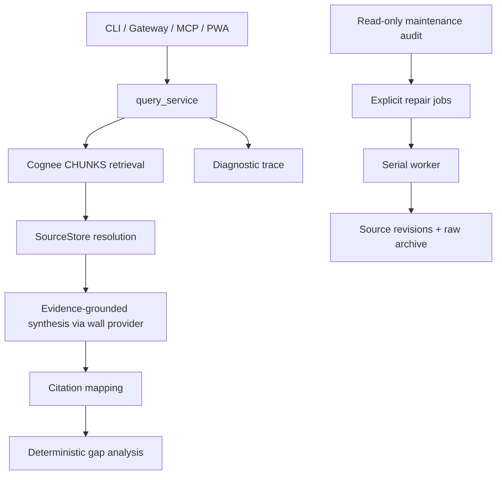

# GBrain-inspired Knowledge Quality - Plan

## Goal Capsule

- **Objective:** Extend `kb` with six GBrain-inspired capabilities: separate retrieval and synthesis, claim-level citations, gap analysis, query diagnostics, controlled maintenance, and source version history.
- **Authority:** Preserve `kb`'s local/cloud wall isolation, serial Cognee access, versioned Markdown raw layer, and `kb.toml` topology over feature parity with GBrain.
- **Execution profile:** Deliver five incremental production features first; begin source version history only after its Cognee lifecycle gate passes.
- **Stop conditions:** Do not introduce Postgres, a second graph writer, cross-wall querying, cloud calls from a local wall, or autonomous content rewriting.
- **Tail ownership:** Each user-visible capability updates `README.md` in the same implementation unit; operational behavior is documented before rollout.

---

## Product Contract

### Summary

`kb` will expose retrieval evidence independently from generated answers, attach citations to answer claims, report uncertainty and corpus gaps, explain why sources were selected, audit knowledge health without silently rewriting content, and retain revisions when a known source changes.

The implementation remains a thin layer around Cognee 0.3.x. It does not replace Cognee's graph or introduce GBrain's Postgres, schema-pack, OAuth, or autonomous-agent platform.

### Problem Frame

The current query path in `kb/cognee_io.py` runs `GRAPH_COMPLETION` and a secondary `CHUNKS` search, but returns only the generated answer and at most one related source. A user cannot inspect ranked evidence, connect individual claims to sources, distinguish missing evidence from confident knowledge, or diagnose retrieval misses. The system also lacks a controlled corpus-health cycle and a safe lifecycle for changed source content.

### Requirements

**Retrieval and answer contract**

- R1. The Instance Service must expose a retrieval-only operation that returns normalized ranked evidence without running answer synthesis.
- R2. The existing answer operation must remain backward compatible while returning a structured evidence envelope for new clients.
- R3. Retrieval and synthesis must run inside the existing per-instance Cognee lock and may never cross wall boundaries.
- R4. MCP and CLI surfaces must offer distinct search and answer semantics without multiplying vault-selection rules.

**Citations and gaps**

- R5. Synthesized answers must return citations that reference known `SourceRecord` IDs and never invent an inaccessible source.
- R6. Citation granularity must be claim or paragraph level where the model output permits it; unresolved mapping must be represented honestly rather than guessed.
- R7. Each answer must include deterministic gap signals for no evidence, stale evidence, failed evidence retrieval, unresolved sources, and uncited answer text.
- R8. Gap analysis must remain useful when the synthesis model or CHUNKS lookup partially fails.

**Diagnosis and maintenance**

- R9. A diagnostic command must show query variants, normalized evidence, source resolution, exclusion reasons available from `kb`, timing, and partial failures without exposing secrets or raw private content by default.
- R10. A maintenance command must audit stale records, missing raw files, orphan raw files, duplicate hashes, failed jobs, malformed source metadata, and pending re-index work.
- R11. Maintenance must default to read-only and require an explicit action for every repair class.
- R12. Repairs must use the existing queue and serial worker whenever they affect Cognee.

**Source revisions**

- R13. Re-ingesting a known locator with changed content must preserve the prior raw revision and record the relationship between revisions.
- R14. Identical content must remain idempotent and must not create a revision.
- R15. A changed revision must not leave stale content queryable as current; implementation is gated on a verified Cognee delete/replace or deterministic vault rebuild path.
- R16. Revision history must be inspectable through CLI and the existing sources UI without allowing cross-vault access.

### Key Flows

- F1. **Retrieval-only query:** A client selects one vault, `kb` runs CHUNKS retrieval, normalizes results, resolves `source_id` values against `SourceStore`, and returns ranked evidence with warnings.
- F2. **Cited answer:** A client asks a question, `kb` retrieves evidence, generates or obtains an answer, maps citation markers to verified sources, computes gap signals, and returns a backward-compatible response.
- F3. **Diagnostic run:** An operator invokes a diagnostic command, receives a redacted explanation of retrieval and resolution, and can opt into content excerpts locally.
- F4. **Maintenance audit:** An operator runs a read-only health pass, reviews categorized findings, and explicitly applies supported repairs through the queue.
- F5. **Changed source:** Ingest recognizes a stable locator with a new hash, archives the old raw revision, replaces or rebuilds derived Cognee state, and activates the new revision atomically from the user's perspective.

### Acceptance Examples

- AE1. Given a question with three retrieved chunks from two sources, retrieval-only mode returns both sources and ranked chunk metadata without a generated answer.
- AE2. Given an answer with two supported paragraphs and one unsupported paragraph, the response cites the supported paragraphs and emits an `uncited_answer_text` gap for the third.
- AE3. Given only sources older than the configured staleness threshold, the answer remains available and includes a `stale_evidence` gap with the newest evidence date.
- AE4. Given CHUNKS failure after successful `GRAPH_COMPLETION`, the answer is preserved and reports `evidence_unavailable`; this retains the behavior protected by `tests/test_cognee_io.py`.
- AE5. Given a maintenance audit without `--apply`, no database, raw file, queue, or Cognee state changes.
- AE6. Given the same URL and identical normalized body, re-ingest reports a duplicate and creates no revision; changed content creates exactly one revision after the lifecycle gate passes.

### Success Criteria

- Every answer response is backward compatible for the current PWA while new clients can consume evidence, citations, and gaps.
- Retrieval-only calls incur no answer-generation LLM call.
- All returned citation targets pass vault ownership and raw-path confinement checks.
- On a fixed evaluation corpus, 100% of citation targets resolve to the requested vault, at least 90% of cited claims are supported by their cited evidence, at least 80% of externally verifiable answer claims carry a citation, and deterministic gap signals stay below a 10% false-positive rate.
- Diagnostic and maintenance read-only paths work when an Instance Service is unavailable, clearly marking Cognee-dependent checks unavailable.
- No implementation weakens the `local` wall's Ollama-only guard or Kuzu single-writer discipline.

### Scope Boundaries

**Included:** CLI, Instance Service, Gateway, MCP, PWA chat/source views, SQLite metadata, raw Markdown revisions, tests, and documentation needed for the six capabilities.

**Deferred:** custom hybrid ranking outside Cognee, query expansion, a separate reranker, automatic contradiction adjudication, scheduled cron execution, background autonomous enrichment, multi-user ACLs, and source deletion UI.

**Excluded:** adopting GBrain as a dependency, migrating to Postgres/PGLite, replacing Cognee, merging local and cloud walls, or letting a maintenance task rewrite source meaning.

### Dependencies

- Existing serialized Cognee access in `kb/cognee_io.py` remains mandatory.
- Existing source resolution in `kb/instance_service.py`, `kb/sources.py`, and `kb/rawstore.py` is the trust boundary for citations.
- Source version activation depends on proving a correct derived-data replacement path with Cognee 0.3.x.

---

## Planning Contract

### Key Technical Decisions

- KTD1. **One internal evidence model:** Introduce typed internal records such as `EvidenceChunk`, `Citation`, `GapSignal`, and `QueryResult` in a new `kb/query_models.py`. All CLI, HTTP, MCP, and PWA representations derive from this model to prevent contract drift.
- KTD2. **Evidence-first orchestration:** Add a single query orchestration layer in `kb/query_service.py`. It retrieves evidence once and either returns it directly or passes the numbered chunks to `kb/synthesis.py`, which uses the provider selected for that wall under the existing environment guard. The synthesis contract returns structured answer claims with evidence IDs; transport modules remain thin.
- KTD3. **No fabricated claim mapping:** `kb/synthesis.py` accepts citations only to evidence IDs present in its input and resolves them to vault-owned `SourceRecord` IDs. Invalid or ambiguous references are removed from the citation set and reported as uncited; separately retrieved CHUNKS are never retroactively presented as proof for an independent `GRAPH_COMPLETION` answer.
- KTD4. **Deterministic gaps before model commentary:** Freshness, missing evidence, retrieval failure, unresolved sources, and citation coverage are computed in Python. V1 does not infer semantic contradictions from prose because the current Cognee query surface exposes no verified contradiction signal. Optional prose about gaps may summarize computed facts but cannot replace them.
- KTD5. **Diagnostics reuse production code:** Diagnostic output is a trace emitted by `query_service`, not a second search implementation. Content excerpts are opt-in and stay local to the requesting surface.
- KTD6. **Maintenance is audit-first:** `kb maintain <instance>` produces findings; `--apply <repair>` enables one named repair class. There is no broad `--fix-all` in the first version.
- KTD7. **Revision history separates identity from revision:** Add a stable logical source identity and store immutable revisions beneath it. Web/PDF sources use the normalized final URL without fragments; YouTube sources use the normalized video ID; files use the resolved import-relative path plus an import-root identity rather than an absolute machine path; snippets without a caller-supplied locator create a new logical source and continue to deduplicate only by content hash. Existing source IDs remain valid revision IDs for compatibility, and identities never cross vaults.
- KTD8. **Correctness gate for revisions:** Before U8, a focused spike must prove either per-document Cognee replacement with persisted Cognee data IDs or a deterministic whole-vault rebuild from active raw revisions. If neither is correct, stop U8 while shipping U1-U7.

### High-Level Technical Design

### Sequencing

1. Establish shared query models and characterize current behavior.
2. Separate retrieval from synthesis and expose transport contracts.
3. Add citations and deterministic gap analysis.
4. Add diagnostics using the same orchestration trace.
5. Add audit-only maintenance, then individually gated repairs.
6. Run the source-lifecycle spike and implement revisions only on a proven replacement path.
7. Complete PWA presentation, documentation, and end-to-end verification alongside each capability rather than as a final cleanup batch.

### System-Wide Impact

- **API compatibility:** `/query` keeps `answer` and `sources`; new fields are additive. A new `/search` endpoint carries retrieval-only behavior.
- **Privacy:** Diagnostic payloads redact content by default. Source lookup always verifies the requested vault.
- **Performance:** Retrieval-only avoids synthesis cost. Cited answers replace the independent `GRAPH_COMPLETION` answer with one structured, evidence-grounded synthesis pass and must not run duplicate CHUNKS searches.
- **Storage:** Maintenance adds no state except explicit repair jobs. Revisions add SQLite metadata and archived Markdown files only after U7's gate.
- **Operations:** New CLI/MCP commands require README and MCP setup documentation updates.

### Risks and Mitigations

| Risk | Impact | Mitigation |
|---|---|---|
| Cognee CHUNKS result shapes vary | Evidence parsing silently loses sources | Keep defensive traversal tests for objects, dicts, ACL payloads, and malformed results |
| Model emits invalid citation markers | Misleading trust signal | Resolve markers against vault-scoped `SourceStore`; reject unknown IDs and emit a gap |
| Gap analysis creates false certainty | Users treat heuristics as facts | Return typed observations and thresholds, not an overall confidence score; semantic contradiction detection stays deferred |
| Diagnostics leak private content | Local knowledge appears in logs or remote responses | Redact excerpts by default; never log raw chunks; require an explicit content flag |
| Maintenance repair corrupts derived state | Raw and Cognee layers diverge | Read-only default, one repair class at a time, queue all Cognee mutations |
| Changed sources remain duplicated in Cognee | Old facts appear current | Gate revision implementation on verified delete/replace or rebuild semantics |

---

## Implementation Units

### U1. Shared query contracts and characterization

- **Goal:** Create the internal evidence, citation, gap, trace, and response models while freezing existing `/query`, CLI, MCP, and PWA behavior in tests.
- **Requirements:** R1-R3, R5-R8
- **Files:** `kb/query_models.py`, `kb/cognee_io.py`, `kb/instance_service.py`, `tests/test_query_models.py`, `tests/test_cognee_io.py`, `tests/test_instance_service.py`
- **Approach:** Normalize Cognee results into immutable typed records. Preserve the existing answer and source response shape as a compatibility projection.
- **Test scenarios:** Empty results; dict and object result shapes; duplicate source IDs; unknown source IDs; CHUNKS failure after answer success; stable JSON serialization; no raw chunk content in default trace.
- **Verification:** Targeted Python tests plus `uv run mypy kb` and `uv run ruff check kb tests`.

### U2. Retrieval-only operation

- **Goal:** Separate raw retrieval from answer synthesis across Python, HTTP, CLI, and MCP surfaces.
- **Requirements:** R1-R4
- **Files:** `kb/query_service.py`, `kb/cognee_io.py`, `kb/instance_service.py`, `kb/gateway.py`, `kb/cli.py`, `kb/mcp_server.py`, `tests/test_query_service.py`, `tests/test_instance_service.py`, `tests/test_gateway.py`, `tests/test_cli.py`, `tests/test_mcp_server.py`, `README.md`, `ops/mcp-setup.md`
- **Approach:** Add a reusable `retrieve` path and `/search` Instance Service endpoint. Gateway proxies `/api/search`. CLI exposes `kb search`; MCP registers vault-scoped retrieval tools while retaining current answer tools under backward-compatible names.
- **Test scenarios:** Retrieval invokes CHUNKS but not GRAPH_COMPLETION; correct datasets per vault; `search_all` stays inside one wall; service unavailable; empty evidence; partial malformed chunks; current `kb query` behavior unchanged.
- **Verification:** Targeted transport tests and a mocked assertion that retrieval makes no synthesis call.

### U3. Claim-level citations

- **Goal:** Return verified citations linked to answer paragraphs or claims.
- **Requirements:** R5-R6, R8
- **Files:** `kb/synthesis.py`, `kb/query_service.py`, `kb/query_models.py`, `kb/cognee_io.py`, `kb/guard.py`, `kb/instance_service.py`, `web/src/pages/chat.astro`, `web/src/lib/api.js`, `tests/test_synthesis.py`, `tests/test_query_service.py`, `tests/test_instance_service.py`, `web/tests/ui-source.test.mjs`, `README.md`
- **Approach:** Send numbered, vault-resolved evidence chunks to the wall's configured LLM and require a structured response of answer claims plus evidence IDs. Validate every returned ID against the input set and `SourceStore`, compose the display answer from validated claims, and expose citations separately from text. The local wall must use Ollama through the same provider-policy guard as Cognee.
- **Test scenarios:** Multiple claims cite one source; one claim cites multiple sources; invalid and cross-vault evidence IDs; duplicate IDs; structured synthesis failure; answer claim without evidence; hostile model output; local wall rejects a cloud provider; PWA renders citations without unsafe HTML or unsafe URL schemes.
- **Verification:** Python contract tests, web tests, and a manual local/cloud smoke query using non-sensitive fixtures.

### U4. Deterministic gap analysis

- **Goal:** Add machine-readable knowledge-gap observations to every answer.
- **Requirements:** R7-R8
- **Files:** `kb/gap_analysis.py`, `kb/query_models.py`, `kb/query_service.py`, `kb/config.py`, `kb.toml`, `web/src/pages/chat.astro`, `tests/test_gap_analysis.py`, `tests/test_config.py`, `tests/test_query_service.py`, `web/tests/ui-source.test.mjs`, `README.md`
- **Approach:** Compute typed gaps from evidence count, resolved citation coverage, source dates, unresolved source IDs, and retrieval errors. Configure only the staleness duration; keep all other rules fixed until measurements justify tuning. Semantic contradiction detection is deferred until a separately validated analyzer or structured fact surface exists.
- **Test scenarios:** No evidence; stale-only evidence; mixed fresh and stale evidence; unresolved citation; uncited claim; CHUNKS unavailable; no false `no_evidence` when evidence exists; no contradiction claim inferred from merely different prose.
- **Verification:** Table-driven unit tests covering every gap type and PWA rendering tests for zero, one, and multiple gaps.

### U5. Query diagnostics

- **Goal:** Explain retrieval and source resolution without maintaining a parallel query path.
- **Requirements:** R9
- **Files:** `kb/query_service.py`, `kb/query_models.py`, `kb/cli.py`, `kb/instance_service.py`, `tests/test_query_service.py`, `tests/test_cli.py`, `tests/test_instance_service.py`, `README.md`
- **Approach:** Capture stage timings, normalized ranks, source-resolution outcomes, truncation, and errors in a trace. Expose `kb diagnose-query <vault> <question>` with redacted output and an explicit local `--show-content` option. Keep diagnostics out of ordinary responses unless requested.
- **Test scenarios:** Redaction default; explicit excerpts; error timing; unresolved sources; empty results; local and cloud vault routing; no API keys, tokens, env values, or raw content in default output.
- **Verification:** Snapshot-style structured-output tests without brittle wall-clock assertions.

### U6. Controlled maintenance audit and repairs

- **Goal:** Detect corpus-health problems and repair only explicitly selected safe classes.
- **Requirements:** R10-R12
- **Files:** `kb/maintenance.py`, `kb/cli.py`, `kb/queue.py`, `kb/sources.py`, `kb/rawstore.py`, `tests/test_maintenance.py`, `tests/test_cli.py`, `tests/test_queue.py`, `README.md`
- **Approach:** Implement a read-only scanner first. Initial repair allowlist covers stale `running` jobs through existing recovery and removal of confirmed orphan temporary files. Re-index, destructive source deletion, and metadata rewriting remain audit-only until a source-preserving lifecycle operation is proven by U7.
- **Test scenarios:** Missing raw target; raw file outside allowed root; orphan raw file; duplicate content hashes in one versus different vaults; failed and stale jobs; malformed metadata; re-index need is reported but cannot be applied; audit causes zero writes; each repair touches only its declared class; idempotent repeated repair.
- **Verification:** Filesystem and SQLite fixture tests plus a dry-run smoke command against a temporary instance directory.

### U7. Source lifecycle spike

- **Goal:** Prove the only safe way to replace derived Cognee state for one changed source or an entire vault.
- **Requirements:** R13-R15
- **Files:** `kb/cognee_io.py`, `tests/test_cognee_io.py`, `docs/cognee-source-lifecycle.md`
- **Approach:** Test Cognee 0.3.x `add` return identity, per-document delete semantics, graph/vector cleanup, node-set behavior, and dataset rebuild behavior. Record one chosen replacement contract with failure recovery and timing on a representative fixture.
- **Test scenarios:** Replace one source; delete failure; cognify failure after delete; duplicate entity shared by two sources; rebuild interruption; query during rebuild under the existing lock.
- **Verification:** A reproducible integration test or documented spike harness proves that old unique text is absent and new unique text is retrievable after replacement.
- **STOP condition:** If neither per-document replacement nor whole-vault rebuild prevents stale retrieval, do not implement U8; retain immutable raw history only as a future direction.

### U8. Source revision history

- **Goal:** Preserve changed raw content while exposing exactly one active revision to retrieval.
- **Requirements:** R13-R16
- **Dependencies:** U7 must select and prove the replacement contract.
- **Files:** `kb/sources.py`, `kb/rawstore.py`, `kb/worker.py`, `kb/cognee_io.py`, `kb/queue.py`, `kb/gateway.py`, `kb/cli.py`, `web/src/pages/sources.astro`, `tests/test_sources.py`, `tests/test_rawstore.py`, `tests/test_worker.py`, `tests/test_gateway.py`, `tests/test_cli.py`, `web/tests/ui-source.test.mjs`, `README.md`
- **Approach:** Add logical source identity and immutable revision metadata with an active pointer. Archive raw Markdown under a vault-confined revision path. Activate the new revision only after the U7 replacement contract succeeds; retain the prior active revision on failure.
- **Test scenarios:** Identical re-ingest; first changed revision; repeated changes; failed replacement rollback; canonical locator normalization; same locator in different vaults; revision list ordering; raw-path confinement; PWA and CLI history; old unique text absent from query results.
- **Verification:** Migration tests for existing `sources.db`, end-to-end changed-source test, and a rollback test that proves the previous revision remains active after failure.

---

## Verification Contract

| Gate | Command | Applies to | Done signal |
|---|---|---|---|
| Python unit/integration | `uv run pytest` | U1-U8 | All tests pass |
| Web behavior | `cd web && npm test` | U3, U4, U8 | All UI tests pass |
| Combined baseline | `make test` | Every mergeable milestone | Python and web suites pass |
| Lint | `uv run ruff check kb tests` | U1-U8 | No lint findings |
| Format | `uv run ruff format --check kb tests` | U1-U8 | No formatting drift |
| Types | `uv run mypy kb` | U1-U8 | Strict type check passes |
| Dependency audit | `make audit` | Final milestone | Existing audit policy passes |
| Privacy regression | Targeted guard and routing tests | U2-U8 | Local wall never selects a cloud provider; no cross-wall datasets |
| Revision correctness | U7/U8 integration fixture | U7-U8 | Old unique text is absent and new text is retrievable, or U8 remains stopped |

Roll out U2-U6 behind additive response fields and new commands; no database migration is required before U8. Run U7 in an isolated temporary Cognee root. Back up `var/<instance>/sources.db`, `raw/<vault>/`, and Cognee roots before the U8 migration is exercised on real data.

---

## Definition of Done

- R1-R16 are either implemented and covered by their mapped units or, for R13-R16, explicitly stopped by U7 with evidence.
- Existing CLI, Gateway, MCP, and PWA query behavior remains compatible.
- Retrieval-only mode demonstrably makes no synthesis call.
- Every citation points to a vault-owned `SourceRecord`; unresolved claims are labeled rather than guessed.
- Gap analysis remains deterministic and testable without an LLM.
- Diagnostic output is redacted by default and contains no secrets.
- Maintenance performs no writes without an explicit repair selector and routes Cognee work through the serial queue.
- Revision activation is atomic from the user's perspective and has a tested rollback path.
- `README.md` and `ops/mcp-setup.md` describe every shipped command, endpoint, MCP tool, response field, configuration key, and operational limitation.
- No abandoned spike code, experimental schema, dead flags, or duplicate query implementations remain in the final diff.

---

## Appendix

### Research breadcrumbs

- GBrain retrieval architecture: `https://github.com/garrytan/gbrain/blob/master/docs/architecture/infra-layer.md`
- GBrain engine architecture: `https://github.com/garrytan/gbrain/blob/master/docs/ENGINES.md`
- GBrain distinction between retrieval and synthesis: `https://github.com/garrytan/gbrain#two-ways-to-query-your-brain`
- Existing `kb` query path and CHUNKS fallback: `kb/cognee_io.py`
- Existing source ownership and metadata: `kb/sources.py`, `kb/instance_service.py`
- Existing raw-path confinement: `kb/rawstore.py`, `kb/gateway.py`
- Existing serial worker and queue: `kb/worker.py`, `kb/queue.py`

## Deferred / Open Questions

### From 2026-07-11 review

- **Implementation readiness conflicts with the source-lifecycle gate** — Metadata, U7-U8 (P1, coherence, confidence 100)

  An executor can implement U1-U7, but Feature 6 remains conditional on a Cognee behavior the plan has not proven. Before execution, decide whether to split source revisions into a companion plan after the spike, change this artifact's readiness contract, or accept U7 as the terminal deliverable when replacement is unsafe.

- **PWA interaction contract is undecided** — U3, U4, U8 (P2, design, confidence 75)

  Implementers still lack an authoritative interaction model for inline citation markers, source details, gap prominence, revision navigation, empty states, keyboard access, and screen-reader labels. Choose the intended presentation before the corresponding UI units begin.
